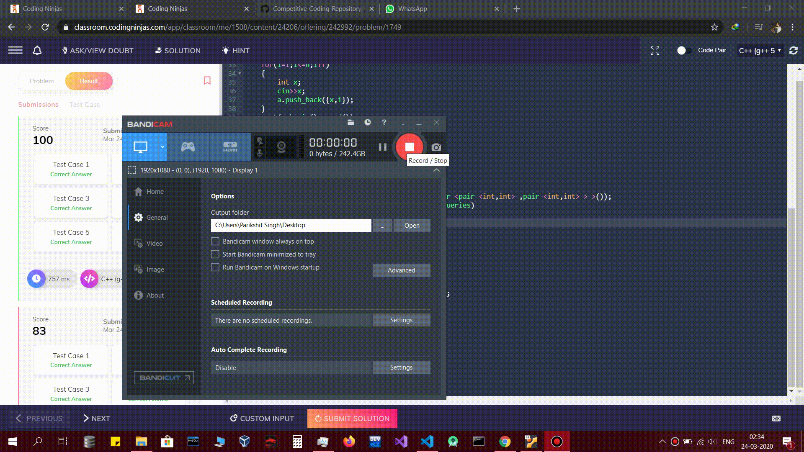

# Coding-Ninjas-Competitive-Programming
This Repository Contains all my codes which I wrote during the competitive programming course with <a href="https://www.codingninjas.com/">Coding Ninjas</a> 
(PS: For some of the questions you may like to check out the commit history to know how did I proceed step by step for any particular question) 

# Insights (In Hinglish)
:slightly_smiling_face: Merge sort is better than selection sort 

:slightly_smiling_face: In bubble sort we compare the first two elements then the next two elements.. and so on, multiple times. So the time complexity of bubble sort is O(n^2). 

:slightly_smiling_face: Time complexity of insertion sort is O(n^2) because it inserts the elements of the array into the sorted part of the array iteratively. 

:slightly_smiling_face: Selection sort is also of the order of n^2 because the smallest element is selected from.the unsorted array and swapped with the leftmost element and that element becomes the part of the sorted array. 

:slightly_smiling_face: For binary search, the time complexity is O(log(n)), because .---->watch theoretical analysis - recursive algorithm in time and space complexity analysis lecture. 

:slightly_smiling_face: Time complexity of merge sort is O(n*log(n)). Because here we divide our array into.two parts and sort them separately and then merge them. 

:slightly_smiling_face: Time and space complexity analysis is very important lecture. kadane's algorithm video lecture is very important too. it has been asked in many popular companies. 

:slightly_smiling_face:Set is implemented in c++ using a balanced binary search tree. it takes log(n) time to find an element in a set or in binary search tree. 

:slightly_smiling_face:Map also uses a binary search tree in the backend. it also takes log(n) time for insertion, deletion, and finding as well, in this way it is different from an unordered map. unordered map is implemented using hashtable. In an unordered map, finding, inserting, and deletion takes O(1) time in average case and O(n) in worst case. worst case bohot kam aata hai. mostly average case hi use hota hai, to in general time complexity for an unordered map is considered to be of the order of 1. 

:slightly_smiling_face:Jab indexes and elements ko compare karne ka man kare aur aisa lag raha ho ki tumhara solution order of n square time lega then merge sort k baare mei sochna. 

:slightly_smiling_face: For flipping the ith bit we use xor operator (^). (edited) 

:slightly_smiling_face: Tries are the datastructures which are generally used for XOR operations. 

:slightly_smiling_face: The factor that we use to iterate in a fenwick tree is `x&(-x)`. where x is the index of the current node. 

:slightly_smiling_face: The time complexity of Sieve Of Eratosthenes is Nlog(log(N)) 

:slightly_smiling_face: The time complexity of Euclid's algorithm for finding the GCD of two numbers is `log2(max(a, b))`, where a and b are the numbers whose GCD is to be find out. 

:slightly_smiling_face: Diophantine Equations-> ax+by=c , this equation will have integral solution only when the gcd(a, b) divides c. 

:slightly_smiling_face: Multiplicative Modulo Inverse -> `(A.B)%m=1` ->`(A.B-1)%m=0` -> `(A.B-1)=m.q` -> `(A.B)-m.q=1` -> `(A.B)+(m.Q)=1` -> Now according to extended euclid algorithm, this equation will have integral solution only when gcd(A, m) divides 1, i.e. `gcd(A, m)==1`. Which in turn means that A and m should be Coprime. Hence we can say that, `(A.B)+(m.Q)=gcd(A, m)`. Its code can be found <a href="Number theory-1/Multiplicative_modulo_Inverse.cpp">here</a>. 

:slightly_smiling_face: If a number `N` is written in the form `p1^a.p2^b.p3^c.....pn^k`, where `a, b, c, ..... , k` are non negative integers and `p1, p2, p3....pn` are prime numbers, then the number `N` will have exactly `(a+1)*(b+1)*(c+1)*...*(k+1)` number of divisors. 

:slightly_smiling_face: **Euler's Totient Function:**
1. Φ(n) is the number of `m` such that, `1<=m<n` and **n and m are coprime** that is `gcd(m, n)==1`.
2. `Φ(a.b)=Φ(a)*Φ(b)`, on the condition that a and b are coprime, i.e. `gcd(a, b)=1`.
3. Since every number `n` can be expressed in the form of its prime factors, i.e. `n=p1^a*p2^b*p3^c.....pt^k`. So according to the property of Euler totient function, we can write `Φ(n)=Φ(p1^a)Φ(p2^b)Φ(p3^c)....Φ(pt^k)`. Now lets talk about Φ(p^a). Here, according to the definition of Euler's Totient function, Φ(p^a) is the number of `m` such that `m and p^a` are coprime and m belongs to \[1, m). Now, since p is a prime, so `p, 2p, 3p, 4p..... up to p^(a-1)` are those numbers which are not coprime with p^a. so we can write: `Φ(p^a)=p^a-(total elements not coprime to p^a)`. i.e. `Φ(p^a)=p^a-p^{a-1}`. hence `Φ(p^a)=p^a(1-(1/p))`. Finally we can write that, `Φ(n)=Φ(p1^a)Φ(p2^b)Φ(p3^c)....Φ(pt^k)`, which implies `Φ(n)=p1^a(1-(1/p1))*p2^b(1-(1/p2))*p3^c(1-(1/p3)).....pt^k(1-(1/pt))`. and Finally we have **`Φ(n)=n*(1-(1/p1))*(1-(1/p2))*(1-(1/p3))*....(1-(1/pt))`**, where t is the number of distinct prime factors. 

:slightly_smiling_face: `LCM(a, n)=(a*n)/GCD(a, n)` 

:slightly_smiling_face: **Fermat's Little Theorem:**
1. If p is a prime number, then `(a^p)%p=a`.
2. `a^p≡a` on the condition of %p, now dividing by a on both sides, we get `a^(p-1)≡1` on the condition of %p. hence **`a^(p-1)%p=1`**.
3. Its application is in calculating mod inverse.
4. If m is a prime number, then, `(a^(-1))%m=(a^(m-2))%m`. 

:slightly_smiling_face: Nth root of unity, `Wn=pow(e, (2*pi)/n)`. and also `pow(e, i(theta))=cos(theta)+i*Sin(theta)`

# Important lectures and questions to revised again(bookmarks):
1. **Oscillating prices of chakri** in prerequisites lecture
2. **Arrays and pointers video lecture** in lecture: pointers(optional to understand c++)
3. **"what is the output"** question after arrays and pointers video lecture in lecture: pointers(optional to understand c++)
4. **characters and pointers video lecture** in Lecture : Pointers(Optional To Understand C++)
5. **Address type casting** in lecture :dynamic allocation(optional to understand c++)
6. **reference and pass by reference video lecture** in Lecture : Dynamic Allocation(Optional To Understand C++)
7. **second and third fill the output question** after macros global variable video lecture in Lecture : Dynamic Allocation(Optional To Understand C++).
8. **First index of a number** in lecture: basics of recursion
9. **Last index of a number** in lecture :basics of recursion. Although i did it in the first attempt, but i liked this one.
10. **all indices of number** in lecture: basics of recursion.
11. **time and space complexity analysis** lecture is very important.
12. **live question 1** in time and space complexity lecture.
13. **live question 2** in the lecture time and space complexity analysis.
14. **live question 3** in lecture language tools. i can;t do it.
15. **warm reception** in language tools.. it is a very good question. clears all the concepts of time complexity.
16. **triplet sum** in language tools + time complexity assignment.
17. **longest consecutive sequence** in lecture language tools + time and complexity assignment
18. **aggressive cows problem** in searching and sorting applications. - i did it myself and is a very good problem.
19. **aggressive cows and inversion count problems** are searching ans sorting applications respectively. these are very important.
20. **searching and sorting applications lecture** is very very important.
21. **last question** of advanced recursion.
22. **alpha code question** in dynamic programming-1.
23. **largest bitonic subarray** in dynamic programming -1 lecture. (I raised a doubt regarding this. I couldn't do it myself).
24. dynamic programming-1 live **question 1**.
25. dynamic programming-1 **live question 2**.
26. dynamic programming -1 -**minimum count** question.
27. **adjacent bit count** and the **problem before that** are important. these are for the basic concept. in dynamic programming-1.
28. **All the assignment questions in DP-1** are also important.
29. **last problem of DP-1** is also very important, I couldn't do it myself
30. **balika vadhu** probelm in dp-2.
31. **Trader Profit** in dp2.
32. **Distinct subsequences** in dynamic programming 2.
33. **shortest subsequence** in dp2.
34. **weighted job scheduling** in greedy problems(very very important)
35. **2vs3** in segment trees
36. **Prims algorithm** in graphs 2
37. **connected horses** in advanced graphhs.
38. **FillMTR** and **AIRPORTS** in Advanced Graphs.
39. **Monk and the islands** in advanced graphs.
40. **Maximum XOR Subarray** in Tries.
41. **Distinct Query Problem**, **OrderSet Problem**, **KQUERY Problem**, **Shil and Wave Sequence**, **INCSEQ(Very Important)**
 in Fenwick Tree Lecture.
42. **Counting APs** and **Number of Strings** in DP & Bitmasking.
43. **Sachin and Varun Problem** in applications of number theory-1.
44. **Card Game** in Applications of Number theory-1.
45. **Segmented sieve problem** in number theory 2.
46. **Warehouse** in Computaional Geometry.

# Lectures to be done again
1. Greedy
2. Advanced Graphs
3. Fenwick Trees
4. Number Theory 3

# Tips for Faster C++ code Executions
1. Avoid cin/cout, use scanf/printf at any cost. Cin/Cout are extremely time consuming functions. If you want even better performance use getchar_unlocked. <a href="http://abhisharlives.blogspot.com/2012/06/really-fast-io-methods-for-programming.html">This</a> article explains it pretty well.
2. Try using global arrays instead of passing them to a function. Passing array as a pointer to a function is efficient, but declaring a global array and directly using it is even better. And of course, avoid passing arguments by value. Similarly, if you are passing a vector to a function, use a constant reference.
3. Use macros and Inline functions. Calling a function involves overhead which can be avoided by using macros or inline functions, but you need to very careful.
4. Use pre-increment instead of post-increment. Post increment is designed to return the original object, which might force the compiler to create another copy of the object in some cases.
5. Use left/right shift in place of division/multiplication by 2. For example you can replace x = x*4 by x = x<<2.
6. Use heap memory only when absolutely necessary. Dynamic initialization and deallocations is costly. 
7. Use multiple arrays instead of one large array.
8. Use unordered_map instead of the usual stl map. Use std::sort instead of qsort.
9. In an if else block, make sure that the condition in if block, is the one that is more likely to be true.
10. **Always use '\n' to change the line. endl takes a lot of time. HERE IS THE PROOF:**  

